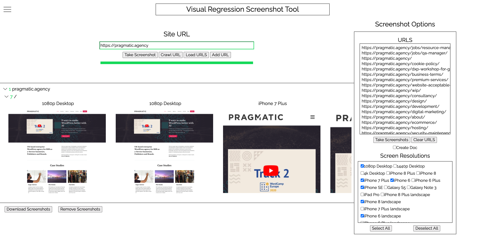

# Screenshot-Tool
A tool to help take screenshots of sites at different resolutions

# Features
- Takes screenshots of websites at different resolutions
- Crawls website for links using sitemap
- Load urls from a file to take screenshots of
- Can add cookie data when taking the screenshot
